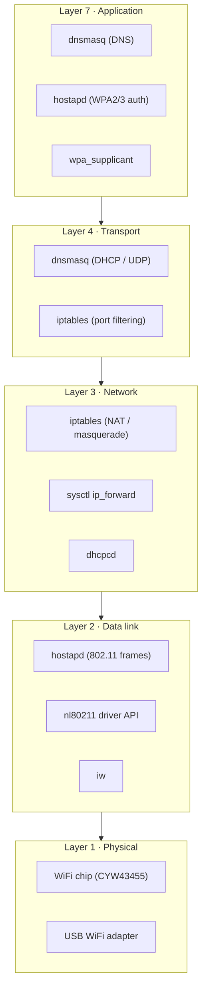
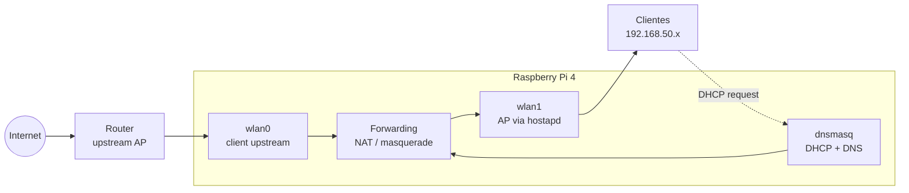

# Raspberry Pi WiFi Repeater (Ansible-managed)

## Purpose

This setup turns the Raspberry Pi into a **routed WiFi repeater**:

- Pi connects to upstream internet (client mode).
- Pi exposes its own WiFi AP for local clients.
- Traffic is forwarded + NATed to upstream.

---

## Main Components

- **hostapd**: creates the Access Point (SSID/security/channel).
- **dnsmasq**: provides DHCP (and optional DNS cache) to AP clients.
- **Linux kernel forwarding**: `net.ipv4.ip_forward=1`.
- **iptables/nftables**: NAT + forwarding rules.
- **wpa_supplicant / NetworkManager**: upstream WiFi connection.



---

## Network Model

- Upstream interface: `wlan0` (client to home router)
- AP interface: `wlan1` (or virtual AP-capable interface)
- AP subnet example: `192.168.50.0/24`
- Pi AP IP example: `192.168.50.1`



---

## Packet Flow (Detailed)

1. Client joins Pi AP (`wlan1`).
2. `dnsmasq` assigns client IP (for example `192.168.50.20`), gateway `192.168.50.1`.
3. Client sends internet traffic to Pi.
4. Pi forwards packets from `wlan1` to `wlan0`.
5. NAT masquerades source to Pi upstream IP.
6. Replies return to Pi, are de-NATed, then forwarded back to client.

---

## Detailed Documentation of Each Component

### hostapd

What it is:

- `hostapd` is the service that turns a WiFi adapter into a hotspot.
- Think of it as the part that says: "My WiFi name is this, my password is this, and devices are allowed to join here."

What it does in this project:

- Broadcasts your repeater SSID (the network name people see).
- Applies WiFi security (WPA2/WPA3 and passphrase).
- Accepts and manages WiFi client connections on the AP interface.

If `hostapd` is broken, you will see:

- No repeater SSID visible on phones/laptops.
- Or SSID is visible but clients cannot join.

Typical settings you choose:

- `ssid`: the name of your repeater network.
- `wpa_passphrase`: the WiFi password.
- `channel`: radio channel used by the AP.

---

### dnsmasq

What it is:

- `dnsmasq` is a small network helper service.
- It usually does two jobs: DHCP (hand out IP addresses) and DNS (translate names like `example.com` into IP addresses).

What it does in this project:

- Gives each connected client an IP in your AP subnet (for example `192.168.50.x`).
- Tells clients: "Use `192.168.50.1` (the Pi) as your gateway."
- Optionally forwards DNS queries upstream.

If `dnsmasq` is broken, you will see:

- Client connects to WiFi but says "No internet" or "Self-assigned IP."
- Client gets no IP address from DHCP.

Typical settings you choose:

- DHCP range, for example `192.168.50.10` to `192.168.50.200`.
- Subnet/gateway info for AP clients.
- DNS behavior (forward upstream, local cache, etc.).

---

### Linux IP Forwarding (`net.ipv4.ip_forward`)

What it is:

- A kernel switch that allows the Pi to pass traffic from one interface to another.

Simple analogy:

- Without forwarding, the Pi is like a house with two doors but no hallway.
- With forwarding enabled, traffic can enter one door (`wlan1`) and leave through the other (`wlan0`).

What it does in this project:

- Allows AP clients to send traffic through the Pi toward the upstream router.

If forwarding is off, you will see:

- Client gets IP address and can reach Pi.
- But client cannot reach internet sites.

---

### NAT and Firewall Rules (`iptables`/`nftables`)

What it is:

- NAT (Network Address Translation) rewrites client source addresses so upstream network can route replies correctly.
- Firewall rules decide which traffic is allowed between interfaces.

Simple analogy:

- NAT is like a receptionist at an office front desk.
- Everyone inside uses internal extension numbers, but the receptionist presents one public number and routes replies back to the right person.

What it does in this project:

- Masquerades traffic leaving `wlan0` so AP clients share Pi's upstream identity.
- Allows forwarding between AP interface and upstream interface.

If NAT/firewall rules are wrong, you will see:

- Client gets IP and can resolve DNS sometimes.
- But connections time out or only partial internet works.

---

### Upstream WiFi Client (`wpa_supplicant` / NetworkManager)

What it is:

- This is the part that connects the Pi itself to your home router or upstream WiFi.

What it does in this project:

- Keeps `wlan0` associated to upstream SSID.
- Gets upstream IP, route, and DNS from your main network.

If upstream client is down, you will see:

- Repeater SSID still exists.
- Devices can join repeater.
- But there is no path to the internet because Pi is not connected upstream.

---

## First Checks When It Does Not Work

Run these on the Pi:

```bash
systemctl status hostapd
systemctl status dnsmasq
ip addr show
ip route
sysctl net.ipv4.ip_forward
```

What "good" looks like:

- `hostapd` is active and AP SSID is visible.
- `dnsmasq` is active and clients get `192.168.50.x` addresses.
- `net.ipv4.ip_forward = 1`.
- Pi has upstream connectivity on `wlan0`.

Quick symptom map:

- SSID missing: check `hostapd` and AP interface.
- Connected but no IP: check `dnsmasq` and DHCP range.
- Has IP but no internet: check forwarding and NAT/firewall rules.

---

## Mini Glossary

- AP (Access Point): the WiFi network clients join.
- DHCP: automatic IP address assignment.
- DNS: translates domain names to IP addresses.
- Interface: a network adapter name like `wlan0` or `wlan1`.
- NAT: lets private clients share one upstream identity.
- Upstream: the network that provides internet access.

---

## Operations

### Boot sequence

1. `wifi-repeater-iface.service` creates `ap0` on `wlan0`, sets `192.168.2.1/24`, disables uplink power save.
2. `hostapd.service` renders `/run/wifi-repeater/hostapd.conf` with the uplink's current channel, then starts the AP.
3. `dnsmasq.service` serves DHCP on `ap0`.
4. `wifi-repeater-firewall.service` adds NAT/forwarding rules (only its own, Docker's rules are untouched).
5. `wifi-repeater-watchdog.timer` checks every 2 minutes and repairs.

The AP shares the radio with the uplink and must use the same channel. If the router changes channel, the watchdog restarts hostapd on the new one (short client drop). An uplink on a 5 GHz DFS channel cannot host an AP.

### Debugging

```bash
systemctl status wifi-repeater-iface hostapd dnsmasq wifi-repeater-firewall
journalctl -u wifi-repeater-watchdog --since today      # repairs done by the watchdog
journalctl -u hostapd -u dnsmasq -n 50
sudo hostapd_cli -i ap0 status
sudo hostapd_cli -i ap0 list_sta                        # connected clients
iw dev wlan0 info | grep channel; iw dev ap0 info | grep channel
sudo iptables -t nat -S POSTROUTING; sudo iptables -S FORWARD
```

### Verify from the control machine

```bash
cd ansible && ansible-playbook site.yml -l raspi-01 --tags wifi-verify --skip-tags common
```
