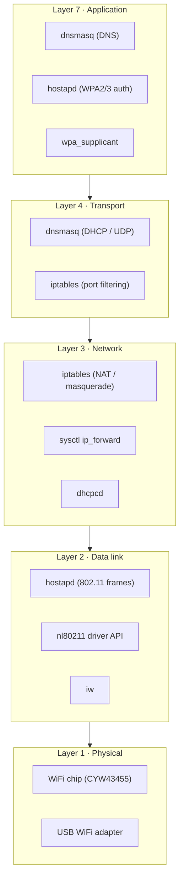
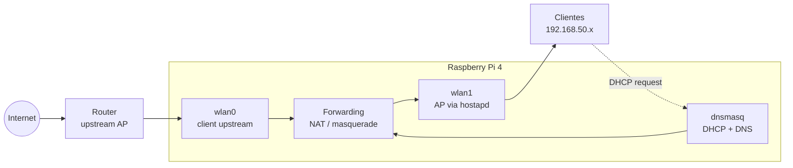

# Raspberry Pi WiFi Repeater (Ansible-managed)

## Purpose

This setup turns the Raspberry Pi into a **routed WiFi repeater**:

- Pi connects to upstream internet (client mode).
- Pi exposes its own WiFi AP for local clients.
- Traffic is forwarded + NATed to upstream.

---

## Main Components

- **hostapd**: creates the Access Point (SSID/security/channel).
- **dnsmasq**: provides DHCP (and optional DNS cache) to AP clients.
- **Linux kernel forwarding**: `net.ipv4.ip_forward=1`.
- **iptables/nftables**: NAT + forwarding rules.
- **wpa_supplicant / NetworkManager**: upstream WiFi connection.

---

## Network Model

- Upstream interface: `wlan0` (client to home router)
- AP interface: `wlan1` (or virtual AP-capable interface)
- AP subnet example: `192.168.50.0/24`
- Pi AP IP example: `192.168.50.1`

---

## Packet Flow (Detailed)

1. Client joins Pi AP (`wlan1`).
2. `dnsmasq` assigns client IP (for example `192.168.50.20`), gateway `192.168.50.1`.
3. Client sends internet traffic to Pi.
4. Pi forwards packets from `wlan1` to `wlan0`.
5. NAT masquerades source to Pi upstream IP.
6. Replies return to Pi, are de-NATed, then forwarded back to client.

---

## Ansible Responsibility Split

- **Role `network`**: interface basics, sysctl forwarding.
- **Role `wifi-repeater`**:
  - install/configure `hostapd`
  - install/configure `dnsmasq`
  - apply NAT/forward rules
  - enable/start services
- **Role `docker`**: independent from repeater core (optional services).

---

## Validation Checklist

- `systemctl status hostapd`
- `systemctl status dnsmasq`
- `sysctl net.ipv4.ip_forward` should be `1`
- NAT rule present (`iptables -t nat -S` or `nft list ruleset`)
- Client can:
  - get DHCP lease
  - ping Pi AP IP
  - resolve DNS
  - access internet

---

## Notes / Caveats

- Best reliability usually needs **two radios** (one upstream, one AP).
- Single-radio AP+client can work but depends on chipset/driver support.
- Prefer WPA2/WPA3 strong passphrase and non-overlapping channels.
- Ensure firewall/NAT rules persist across reboot.

---

## Security Recommendations

- Disable password SSH login if possible; use SSH keys.
- Keep Pi packages updated.
- Limit management access to trusted subnet.
- Store secrets in Ansible Vault (SSID passphrases, keys if sensitive).
