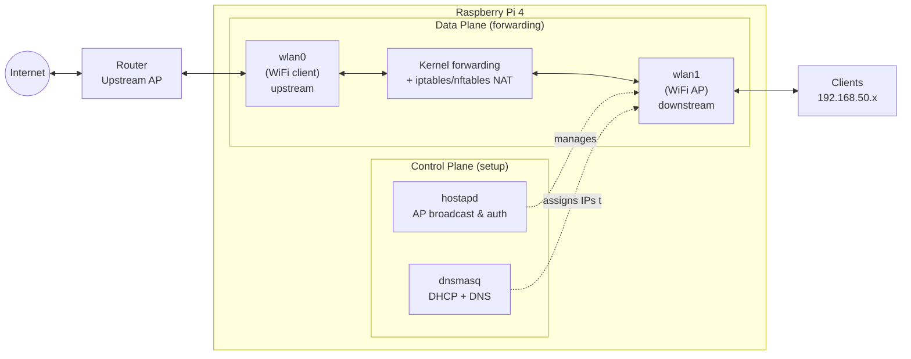
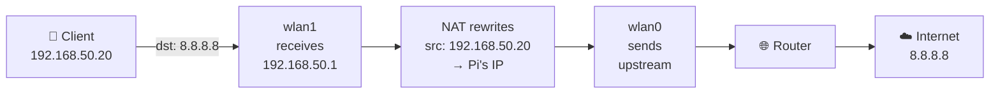
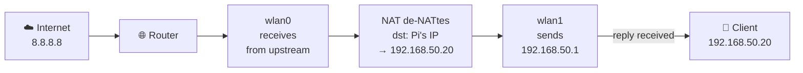

# Raspberry Pi WiFi Repeater (Ansible-managed)

## Purpose

This setup turns the Raspberry Pi into a **routed WiFi repeater**:

- Pi connects to upstream internet (client mode).
- Pi exposes its own WiFi Access Point (AP) for local clients.
- Traffic is forwarded + NATed to upstream.

---

## Main Components

- **hostapd**: creates the Access Point (SSID/security/channel).
- **dnsmasq**: provides DHCP (and optional DNS cache) to AP clients.
- **Linux kernel forwarding**: `net.ipv4.ip_forward=1`.
- **iptables/nftables**: NAT + forwarding rules.
- **wpa_supplicant / NetworkManager**: upstream WiFi connection.

### Component Stack

- **Layer 1 · Physical**: WiFi chip (CYW43455) or USB WiFi adapter
- **Layer 2 · Data Link**:
  - `hostapd` (802.11 frames, WPA2/3 auth)
  - `wpa_supplicant` (upstream WiFi client)
- **Layer 3 · Network**:
  - `sysctl net.ipv4.ip_forward` (kernel forwarding flag)
  - `iptables` (NAT/masquerade rules)
  - `dhcpcd` (DHCP client daemon)
  - `iw` (WiFi interface management)
- **Layer 4 · Transport**:
  - `dnsmasq` (DHCP/UDP for client IP assignment)
- **Layer 7 · Application**:
  - `dnsmasq` (DNS caching/forwarding)
  - `hostapd` config (SSID, security settings)

---

## Network Model

**Network topology:**

- **Upstream interface** (`wlan0`): The Pi connects as a WiFi client to your home router or upstream WiFi network.
- **AP interface** (`wlan1`): The Pi broadcasts its own WiFi hotspot for end devices (phones, laptops, IoT devices) to join.
- **AP subnet example**: `192.168.50.0/24` — the private network for devices connected to the Pi.
- **Pi AP IP**: `192.168.50.1` — the Pi acts as gateway for its AP clients.

**Who are the clients?**

- **Upstream**: The Pi is a client to your home router (or existing WiFi network).
- **Downstream**: End-user devices (phones, laptops, tablets, etc.) are clients to the Pi's repeater AP.



---

## Packet Flow (Detailed)

**What this flow covers:**

- The downstream request path: a client sending internet traffic via the Pi to the upstream network and beyond.
- DHCP assignment on the AP side (`wlan1`) and how the client routes through the Pi as its gateway.
- L3 forwarding and NAT (source rewrite) from `wlan1` to `wlan0` on the outbound leg.
- Return traffic path: de-NAT and forwarding back to the client on the inbound leg.

### Request path (client → internet)



### Response path (internet → client)



**What is not shown (and why):**

- Low-level 802.11 management/authentication frame exchange (handled by `hostapd`/driver), omitted to keep focus on routing behavior.
- DNS query internals and resolver selection, omitted because they are optional to internet reachability if direct IP traffic is tested.
- Conntrack state transitions and firewall chain-level rule evaluation, omitted to avoid implementation-specific details (`iptables` vs `nftables`).
- ARP/neighbor discovery details on each interface, omitted because they are link-local mechanics that do not change the high-level forwarding model.
- Failure/edge cases (roaming, upstream drops, captive portals), omitted to keep this as the baseline "healthy path".

---

### Setup phase (happens once per client)

1. Client joins Pi AP (`wlan1`).
2. Client sends DHCP request.
3. `dnsmasq` assigns client IP (for example `192.168.50.20`) and gateway (`192.168.50.1`).
4. Client is now configured and ready to send internet traffic.

### Outbound path (client sends request)

5. Client sends internet traffic with source IP `192.168.50.20` and destination (for example) `8.8.8.8`.
6. Packet arrives at Pi's `wlan1` interface.
7. Kernel routing table says: "Destination `8.8.8.8` is not local; forward to `wlan0`."
8. **Forwarding enabled** (`net.ipv4.ip_forward=1`) permits this cross-interface routing.
9. **NAT masquerades** the source IP: rewrites `192.168.50.20` to Pi's upstream IP address (e.g., `192.168.100.50`).
10. Packet leaves Pi on `wlan0`, travels to upstream router, then to the internet.

### Inbound path (server replies)

11. Internet server replies to Pi's upstream IP (`192.168.100.50`).
12. Reply arrives at Pi's `wlan0` interface.
13. **NAT de-NATtes**: conntrack recognizes this as a reply to an earlier masqueraded flow and rewrites destination back to `192.168.50.20`.
14. Kernel forwards the de-NATed packet to `wlan1`.
15. Packet reaches original client at `192.168.50.20`.
16. Client receives a reply from `8.8.8.8` as expected, connection completes.

---

### Summary

The critical insight is **NAT symmetry**: outbound traffic is rewritten at step 9 (source) and inbound traffic is rewritten at step 13 (destination). Together, these rewrites allow AP clients to transparently share the Pi's upstream identity while remaining unaware they are behind a repeater. `dnsmasq` only handles the initial setup (DHCP); it is not in the forwarding data path for subsequent traffic.

---

## Detailed Documentation of Each Component

### hostapd

What it is:

- `hostapd` is the service that turns a WiFi adapter into a hotspot.
- Think of it as the part that says: "My WiFi name is this, my password is this, and devices are allowed to join here."

What it does in this project:

- Broadcasts your repeater SSID (the network name people see).
- Applies WiFi security (WPA2/WPA3 and passphrase).
- Accepts and manages WiFi client connections on the AP interface.

If `hostapd` is broken, you will see:

- No repeater SSID visible on phones/laptops.
- Or SSID is visible but clients cannot join.

Typical settings you choose:

- `ssid`: the name of your repeater network.
- `wpa_passphrase`: the WiFi password.
- `channel`: radio channel used by the AP.

---

### dnsmasq

What it is:

- `dnsmasq` is a small network helper service.
- It usually does two jobs: DHCP (hand out IP addresses) and DNS (translate names like `example.com` into IP addresses).

What it does in this project:

- Gives each connected client an IP in your AP subnet (for example `192.168.50.x`).
- Tells clients: "Use `192.168.50.1` (the Pi) as your gateway."
- Optionally forwards DNS queries upstream.

If `dnsmasq` is broken, you will see:

- Client connects to WiFi but says "No internet" or "Self-assigned IP."
- Client gets no IP address from DHCP.

Typical settings you choose:

- DHCP range, for example `192.168.50.10` to `192.168.50.200`.
- Subnet/gateway info for AP clients.
- DNS behavior (forward upstream, local cache, etc.).

---

### Linux IP Forwarding (`net.ipv4.ip_forward`)

What it is:

- A kernel switch that allows the Pi to pass traffic from one interface to another.

Simple analogy:

- Without forwarding, the Pi is like a house with two doors but no hallway.
- With forwarding enabled, traffic can enter one door (`wlan1`) and leave through the other (`wlan0`).

What it does in this project:

- Allows AP clients to send traffic through the Pi toward the upstream router.

If forwarding is off, you will see:

- Client gets IP address and can reach Pi.
- But client cannot reach internet sites.

---

### NAT and Firewall Rules (`iptables`/`nftables`)

What it is:

- NAT (Network Address Translation) rewrites client source addresses so upstream network can route replies correctly.
- Firewall rules decide which traffic is allowed between interfaces.

Simple analogy:

- NAT is like a receptionist at an office front desk.
- Everyone inside uses internal extension numbers, but the receptionist presents one public number and routes replies back to the right person.

What it does in this project:

- Masquerades traffic leaving `wlan0` so AP clients share Pi's upstream identity.
- Allows forwarding between AP interface and upstream interface.

If NAT/firewall rules are wrong, you will see:

- Client gets IP and can resolve DNS sometimes.
- But connections time out or only partial internet works.

---

### Upstream WiFi Client (`wpa_supplicant` / NetworkManager)

What it is:

- This is the part that connects the Pi itself to your home router or upstream WiFi.

What it does in this project:

- Keeps `wlan0` associated to upstream SSID.
- Gets upstream IP, route, and DNS from your main network.

If upstream client is down, you will see:

- Repeater SSID still exists.
- Devices can join repeater.
- But there is no path to the internet because Pi is not connected upstream.

---

## First Checks When It Does Not Work

Run these on the Pi:

```bash
systemctl status hostapd
systemctl status dnsmasq
ip addr show
ip route
sysctl net.ipv4.ip_forward
```

What "good" looks like:

- `hostapd` is active and AP SSID is visible.
- `dnsmasq` is active and clients get `192.168.50.x` addresses.
- `net.ipv4.ip_forward = 1`.
- Pi has upstream connectivity on `wlan0`.

Quick symptom map:

- SSID missing: check `hostapd` and AP interface.
- Connected but no IP: check `dnsmasq` and DHCP range.
- Has IP but no internet: check forwarding and NAT/firewall rules.

---

## Mini Glossary

- AP (Access Point): the WiFi network clients join.
- DHCP: automatic IP address assignment.
- DNS: translates domain names to IP addresses.
- Interface: a network adapter name like `wlan0` or `wlan1`.
- NAT: lets private clients share one upstream identity.
- Upstream: the network that provides internet access.
